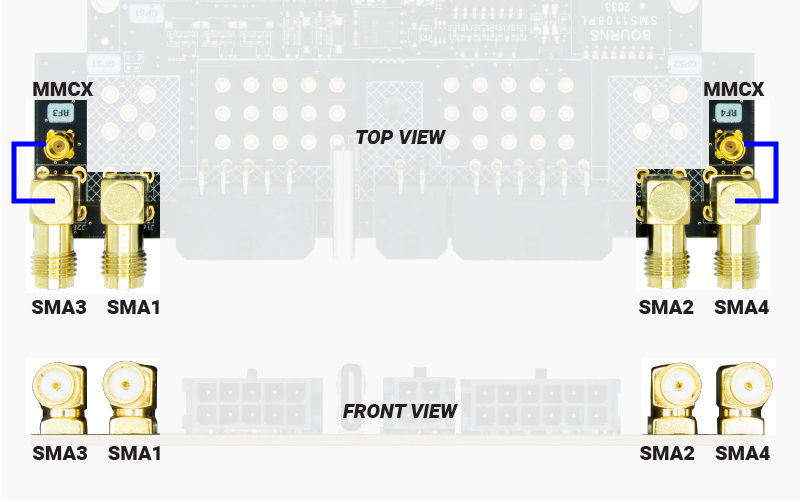

 .. |br| raw:: html

       

SBC RF Antennas
===============

All SBC versions have at least two SMA connectors: SMA1 and SMA2 that are connected internally to GPS1 and GPS2 signal inputs respectively.

In addition to that SMA3 and SMA4 can be used to mount external antennas of some of the SBC peripherals. |br|
SMA3 and SMA4 are connected directly to the MMCX connector next to them, so you can use a pigtail to connect the MMCX conenctor to any of the SBC peripherals. |br|
For example, if you plug the 4G NTRIP master modem on the SBC, you may want to improve the signal reception by adding two external antennas. |br|
You would use a uFL to MMCX pigtail to connect the modem signal output to the MMCX connector and then an external antenna to SMA3 and SMA4.

.. image:: img/pigtails.png
	:align: center
	:width: 500
	:alt: SBC LEDs