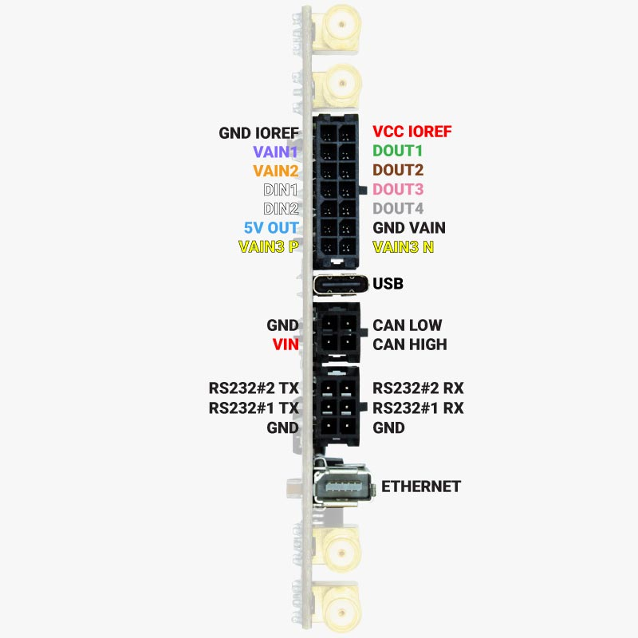
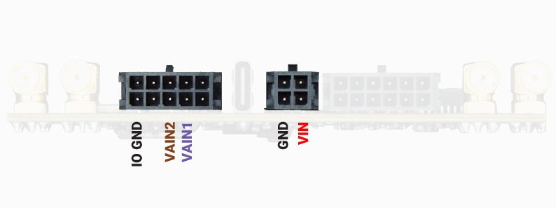
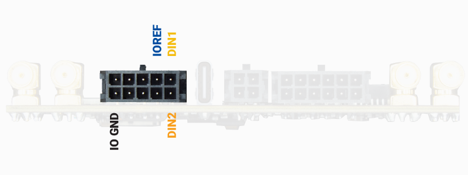
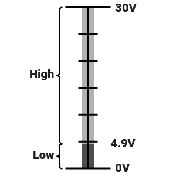
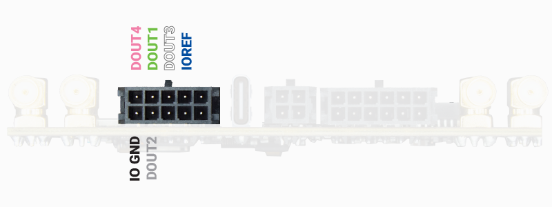

# SBC Pinout, Cables and Interfaces

The SBC has the following interfaces:

* `Analog inputs`
* `Digital inputs`
* `Digital outputs (including PWM)`
* `Timepulse`
* `USB`
* `2 x RS232`
* `Ethernet`
* `CAN Bus`

The picture below shows the generic pinout of the SBC connectors.  
Notice that each connector has a unique shape so it is physically impossible to connect the cables in the wrong place.

In case you need to prepare your own custom wiring harness here you can find the connector part numbers:

| Description               | Cable connector       | SBC connector        |
| ------------------------- | --------------------- | --------------------- |
| Analog input, digital input/output/PWM | Molex #430251000   | Molex #430451000     |
| Power, CANbus             | Molex #430250400      | Molex #430450400      |
| Ethernet, 2 x RS232       | Molex #430251200      | Molex #430451200      |

The general pinout of the SBC is shown in the picture below, where the name of the pins is colored based on the cable color.  
Ethernet, RS232#1, and RS232#2 interfaces have a physical connector so the pin names are not colored on purpose.



## Analog inputs



Pins which voltage can be read by the SBC.  
The SBC supports two analog input pins: **VAIN1**, **VAIN2**.  
In addition to these dedicated pins, you can also monitor the SBC power voltage **VIN**.  
The resolution of the analog reading is 12-bits.

> **Important**
> - Analog input voltage is between 0V and +22V
> - Analog input ground is connected to SBC IO GND, which is different from SBC GND. Both SBC IO GND and SBC GND can be connected together if needed.

For a description and examples of the methods to read these signals, please go to the [SBC Classes - AIN documentation](#ain).

## Digital inputs



Pins which digital status (ON/OFF) can be read by the SBC.  
The SBC supports two digital input pins: **DIN1**, **DIN2**.

> **Important**
> - Digital input voltage is between 0V and +30V
> - Voltage level logic:
>   
> - Digital input ground is connected to SBC IO GND, which is different from SBC GND. Both SBC IO GND and SBC GND can be connected together if needed.

For a description and examples of the methods to read these signals, please go to the [SBC Classes - DIO documentation](#dio).

## Digital outputs (including PWM)



The SBC supports six digital output pins: **DOUT1**, **DOUT2**, **DOUT3**, **DOUT4**.  
Each of these pins can be configured as a standard digital output (0/1) or as a PWM output.

> **Note**
> We have a specific section where you can find details and schematics of devices that you can connect to the SBC digital outputs, such as: [DC motors](#motors_dc), [Servo motors](#motors_srv), [Stepper motors](#motors_step) and [Relays](#relays).

For a description and examples of the methods to read these signals, please go to the [SBC Classes - DIO documentation](#dio).

## Timepulse

**GPS1** Timepulse signal can be used via a specitif pin in the STM32.  
You can use it with the following code:

```python

from sbc import GNSS1

GNSS1.timepulse.high()
GNSS.timepulse.low()
