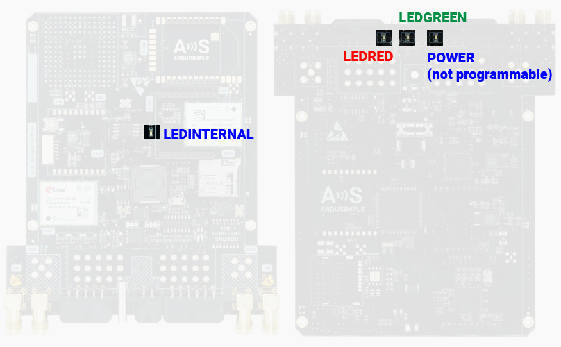

# LEDs

The SBC has a total of 4 LEDs, 3 of them are programmable and can be used for quick diagnostic, feedback, etc..

In the next picture you can see the location of the LEDs and the name used for programming their behavior.

> **Note**  
For details about how to play with the LEDs you can check the [LED Class](../sdk/reference/led) section.
