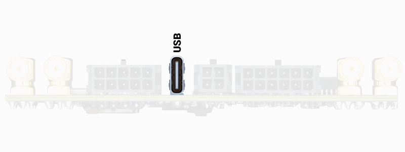
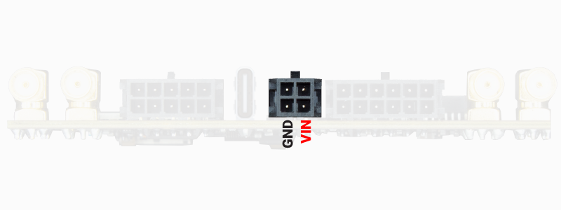

# Power

There are two ways to power the SBC:

* [USB C connector](#usb-c-connector)
* [5-24V DC Molex microfit connector](#5-24v-dc-molex-microfit-connector)

---

## USB C connector

Just plug the provided USB C cable and connect it to your computer or USB wall charger.  
The USB C interface is capable of powering the SBC with all its accessories (4G modem, Bluetooth, WiFi, ...) you only need to make sure that the wall charger/computer USB port is powerful enough to supply it.

*Alignment: center, Width: 400px, Alt text: SBC pinout*

> **Note:** The USB C connector can be used to power the SBC with any commercial USB power bank. This is an easy way to make your SBC tolerant to power interruptions.

### Power consumption in different configurations:

* Minimum power (microprocessor only, no USB hub and no GPS/GNSS receivers): 0.48W (40mA @ 12V, measured at 25ºC)
* 1 GPS/GNSS receiver: 1.56W (130mA @ 12V, measured at 25ºC)
* 2 GPS/GNSS receivers: 1.98W (165mA @ 12V, measured at 25ºC)
* 3 GPS/GNSS receivers: 2.4W (200mA @ 12V, measured at 25ºC)
* 3 GPS/GNSS receiver + 4G NTRIP client + XLR radio: 3.9W (325mA @ 12V, measured at 25ºC)

> **Important:**  
> We do not recommend using the USB C interface to power the SBC for applications involving vibrations (heavy machinery, drones, ...) since this connector may become loose. We suggest using the heavy-duty microfit connector alternative (see [5-24V DC Molex microfit connector](#5-24v-dc-molex-microfit-connector)).

---

## 5-24V DC Molex microfit connector

You need to plug the Molex microfit connector to the SBC and connect the black (ground) and red (positive) wires to any DC power source ranging from 5V to 24V.  
This type of connector is designed to withstand strong vibrations, so it is the perfect choice if your SBC must work in a harsh environment.

*Alignment: center, Width: 400px, Alt text: SBC pinout*

> **Note:**  
> You can power the SBC directly with a 12V or 24V automotive lead battery. The SBC internal voltage regulators will handle the variable voltage of these batteries when they are being charged.
