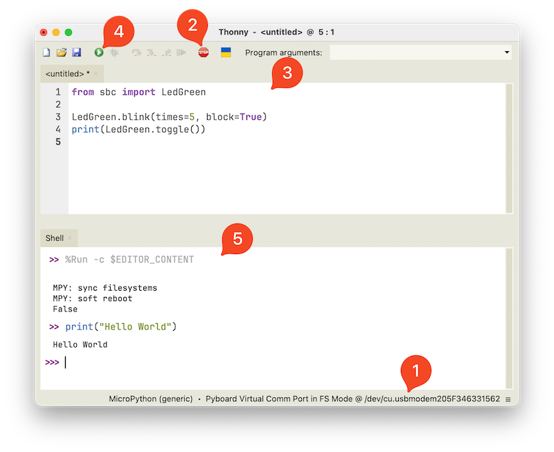
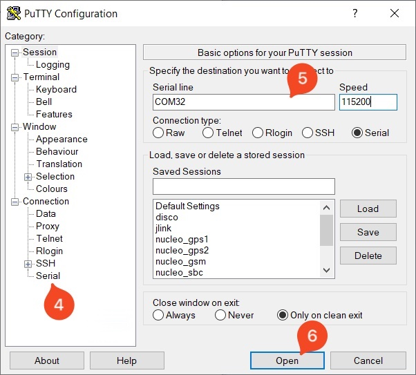
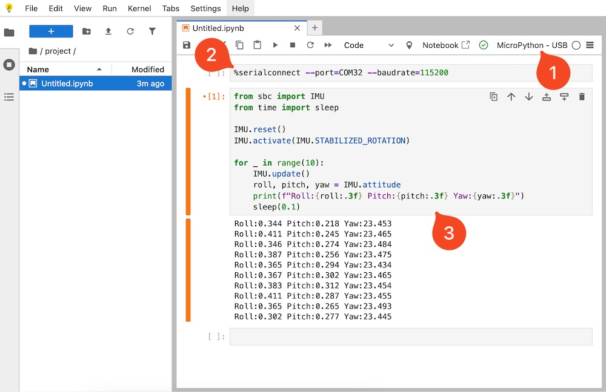

<!-- markdownlint-disable MD033 -->

# MicroPython IDEs

> if you want to write your own software...

An Integrated Development Environment (IDE) is a software application that simplifies and enhances the programming process.

The SBC is compatible with any IDE that supports MicroPython. In this section, we’ll introduce some of the IDEs our engineers use regularly to develop software for the SBC.

## Generic Notepad

Not much to say here 😊

This is the simplest way to edit your code. You can use any Notepad application you like, but [Notepad++](https://notepad-plus-plus.org/downloads) is a good choice since it highlights Python syntax.


## Thonny

[Thonny](https://thonny.org) is a free, lightweight, and cross-platform Python and MicroPython IDE. We like it because we can send and run code directly on the SBC with a single click.



1. Select your SBC’s port and set the interpreter to **MicroPython (Generic)**.
2. Click STOP to halt any running script and start a fresh session.
3. Write your application code in the editor.
4. Click Play to run the code on your SBC.
5. View your application output in the Shell. You can also use the REPL here to run commands interactively.

## Terminal

Although it's not practical for full application development, you can run commands directly from a terminal using tools like [Putty](https://www.putty.org), [Realterm](https://sourceforge.net/projects/realterm), or any other serial terminal.

On **macOS** or **Linux**, connecting to your SBC is straightforward. Just open the native terminal, identify the SBC's serial port, and use *screen* to connect:

```bash
ls /dev/tty.usb*
screen /dev/tty.usbmodem205F346331526
```

Replace the port name with the one that matches your device. Once connected, you’ll be in the MicroPython REPL and can run code directly.

On **Windows**, you shall use an application like *PuTTY* to connect to your SBC.



1. Plug in your SBC via USB.
2. Open Device Manager and check the COM port assigned to your SBC (e.g., COM32).
3. Launch PuTTY.
4. Under Connection type, select Serial.
5. Configure to use the SBC's COM port (e.g., COM32) and Speed (baud rate) to 115200.
6. Click Open.

You should now see the MicroPython REPL prompt. You can type and execute commands directly.

## Jupyter

[Jupyter Notebook](https://jupyter.org/) is an interactive coding environment that supports Python and can be used with MicroPython via tools like mpremote, pyboard.py, or custom kernels.

It’s a bit more advanced to set up, but an interesting alternative if you want to combine code, output, and documentation in a single place.



1. Create a new notebook and select **MicroPython-USB** kernel.
2. Run a connection cell with the `%serialconnect` command.
3. Add as much cells as you need. Run your code as you would in any notebook.

