<!-- markdownlint-disable MD033 -->

# MicroPython IDEs

> if you want to write your own software...

An IDE (Integrated Development Environment) is a software application that facilitates the programming task.

The SBC is compatible with any IDE that supports MicroPython. In this section we want to introduce some of the IDEs that our engineers use on a daily basis to program the SBC.

## Generic Notepad

Not much to say here 😊

This is the simplest way to edit your code. You can use your preferred Notepad application, although [Notepad++](https://notepad-plus-plus.org/downloads) is a nice one since it highlights Python syntaxis. We use this editor to make quick changes to existing code that does not need much testing.

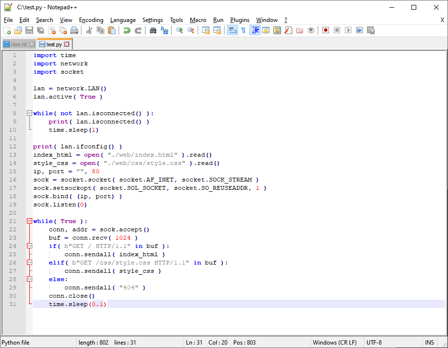

## Thonny

[Thonny](https://thonny.org) is a Python and MicroPython IDE. We like it because it is free, multiplatform, light and easy to use.

In this quick tutorial we will only cover the basics, you can find more information on their website.

1. Connect your SBC to your PC via USB
2. Run Thonny
3. Go to Tools > Options > Interpreter
   1. Select MicroPython (generic) as interpreter
   2. Select your SBC Port
   3. Click OK 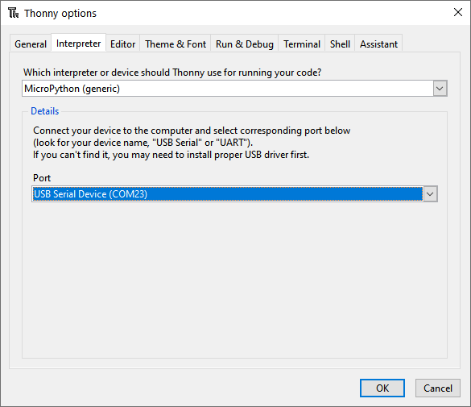
4. Press the STOP button 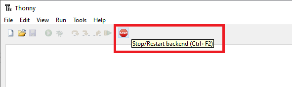

If everything went ok, you should see a similar message in the shell which indicates that you connected successfully to the MicroPython terminal.

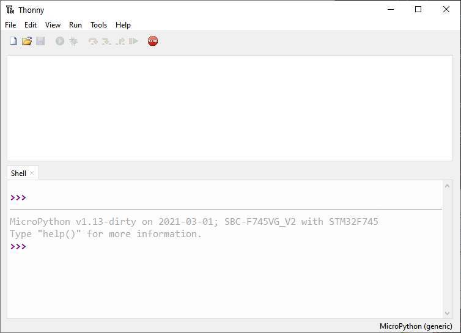

You can now write your application in the main window and click the Play button to run it. You will see your application output in the shell (window at the bottom).

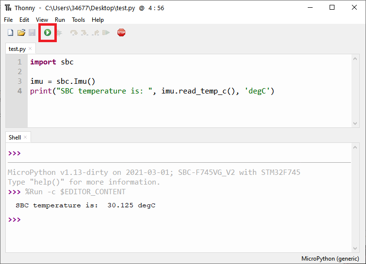

Notice that you can also write commands directly in the shell.

## Terminal

You can run or code any Python application directly from a terminal ([Putty](https://www.putty.org), [Realterm](https://sourceforge.net/projects/realterm), etc.).

We will make a quick tutorial explaining how to connect to your SBC via Putty.

Choose the connection type. Select COMx port and 115200 speed, click Open.
If you don't know your COM port, you can use Windows' Device Manager.

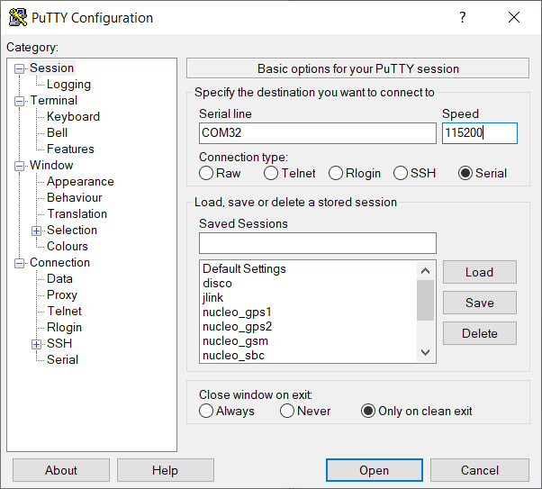

If the connection is succesfull, SBC will show a welcome message and the MicroPython prompt `>>>`

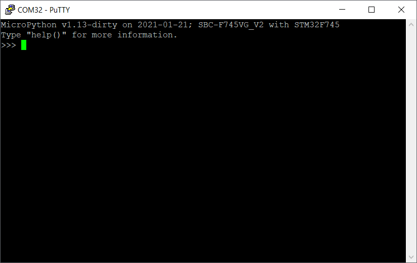

REPL means "Read Eval Print Loop" and it is a native feature of python and MicroPython.
Here the user can develop scripts line by line, define functions or examine variables.

Just write a line of code and hit enter to execute it.

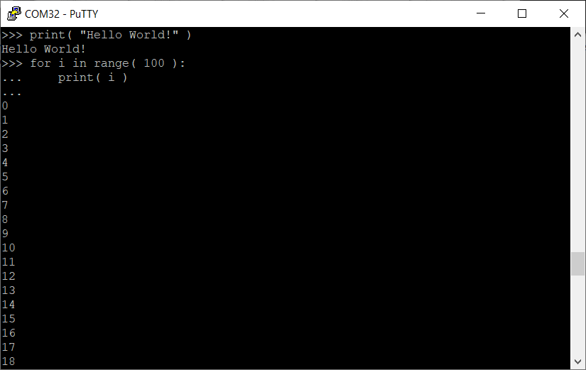

For more complex scripts, MicroPython supports paste mode. This mode allows paste longer scripts to the REPL.
To enter paste mode, press <kbd>CTRL</kbd>+<kbd>D</kbd> in a BLANK LINE. MicroPython should change promt to `===`.
Now you can paste your scritps. Remember that Putty uses mouse right click as paste command.
Press <kbd>CTRL</kbd>+<kbd>E</kbd> to exit from the paste mode and execute your script.

## Jupyter

Before start with jupyter notebooks, you can read the [Notebook Basics](https://nbviewer.jupyter.org/github/jupyter/notebook/blob/master/docs/source/examples/Notebook/Notebook%20Basics.ipynb) guide.

The first step is to add a new notebook, for that you need to press new notebook button and select MicroPython-USB kernel.

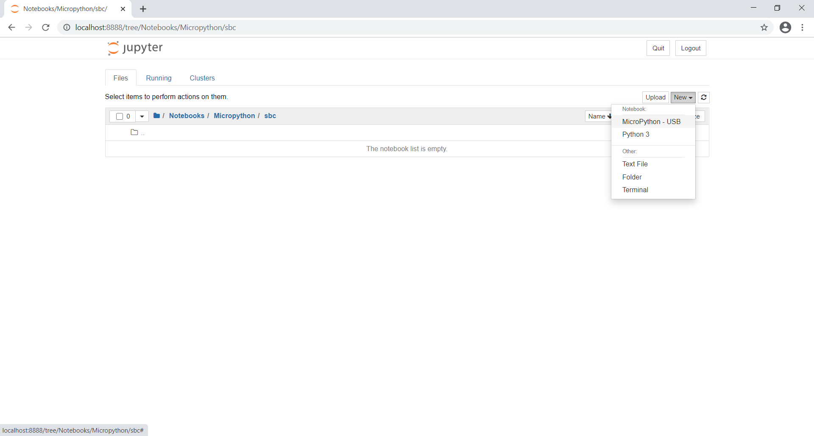

Cells are small scripts that can be executed in MicroPython. Press "+" button to add new cells.

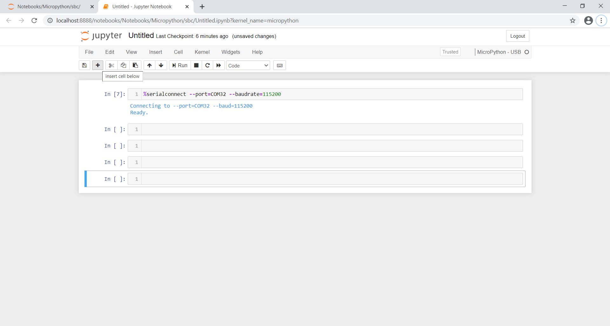

Before executing any sript in MicroPython, you should connect to the SBC. To do so, run a cell with %serialconnect command.
To run cells, select cell and press "RUN" button.

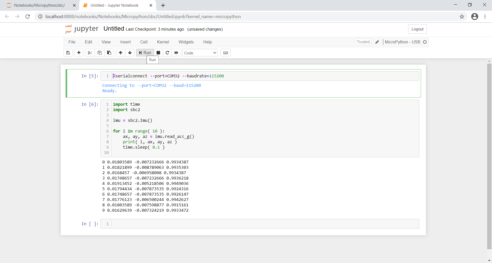

Click the notebook title to rename it.

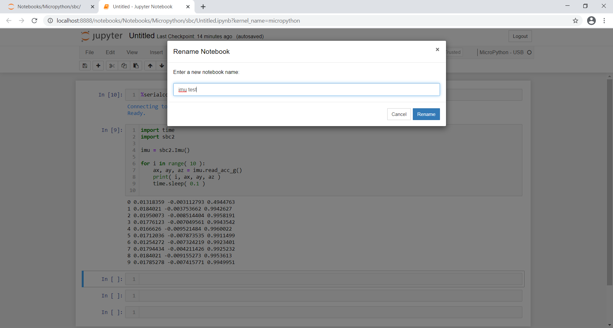

When your script is done, you can save it as a Jupyter notebook (.pynb) or download it as an .html file.

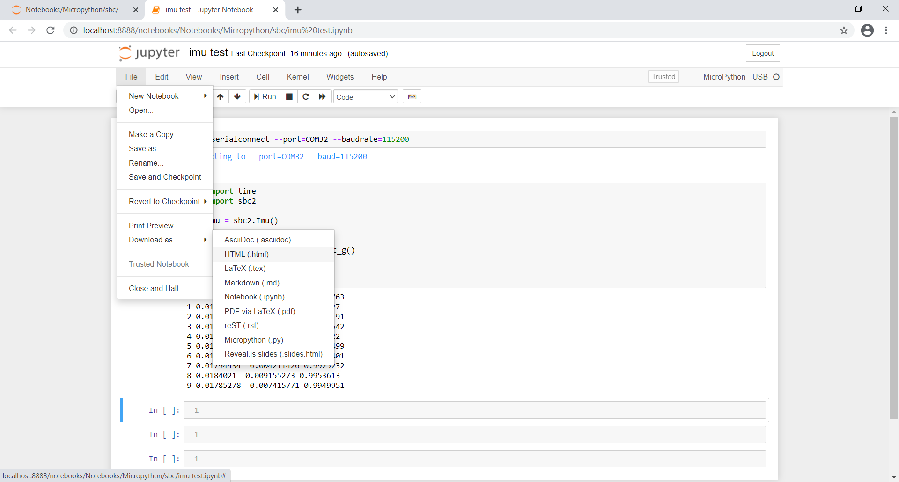
